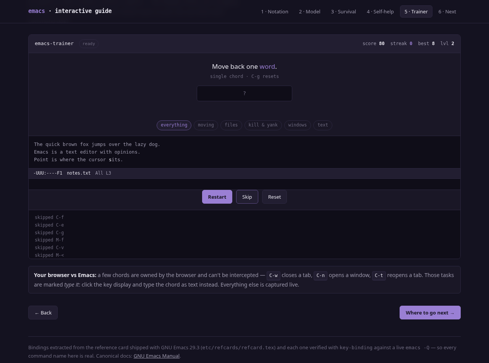

# Emacs — Interactive Guide &amp; Chord Trainer

A single-file interactive guide to GNU Emacs, plus a keyboard minigame that
drills the real chords until your fingers know them.

**▶ [Open the live guide](https://ttiiggss.github.io/emacs-interactive-guide/)**

No build step, no dependencies, no server. One HTML file you can open from disk.

---

## Why this exists

Emacs isn't hard because the commands are complex — it's hard because **nothing
is where your muscle memory expects it**. There's no `Ctrl-S` to save and no
`Ctrl-Z` to undo. The gap between "I installed Emacs" and "I can edit a file
without panicking" is almost entirely keybindings.

So this teaches the notation, the mental model, the ~48 chords that carry a real
session — and then makes you practise them.

## What's in it

| # | Section | Contents |
|---|---------|----------|
| 1 | **Notation** | `C-x`, `M-f`, `C-M-f`, prefix sequences — decoded in a minute |
| 2 | **Model** | Buffer, point &amp; mark, kill ring, prefix keys, modes, `M-x` |
| 3 | **Survival** | 48 bindings in 6 tables, each with its real command name |
| 4 | **Self-help** | `C-h k`, `C-h f`, `C-h a`, `C-h m` — how Emacs documents itself |
| 5 | **Chord Trainer** | The minigame (below) |
| 6 | **Next** | Config, macros, dired, rectangles, registers, packages |

## The Chord Trainer



46 tasks across 6 levels, filterable by category (moving / files / kill &amp; yank
/ windows / text).

- You get a task — *"Kill to the end of the line"* — and press the real chord.
- **Multi-key sequences work properly.** `C-x C-s` must be typed in order, and
  the display shows your progress through the sequence.
- **`C-g` resets a half-typed sequence**, exactly as it does in Emacs.
- The embedded frame reacts: point moves, the modified flag appears in the mode
  line, `Mark set` shows up, and the echo area prints the prompt Emacs would
  actually show (`Find file: ~/`, `I-search:`, `Wrote ~/notes.txt`).
- Five correct in a row levels you up.
- Wrong answers tell you the chord you *should* have pressed, so failing teaches.

### Browser-owned chords

A few chords can't be intercepted by any web page — `C-w` closes the tab, `C-n`
opens a window, `C-t` reopens a tab. Those tasks switch to a **type-it** input
so they're still drillable instead of being silently dropped.

## Accuracy

This is the part that matters. Bindings were **not** written from memory:

1. Extracted from `etc/refcards/refcard.tex` — the reference card shipped with
   GNU Emacs 29.3 — by parsing its `\key{}` and `\threecol{}` macros.
2. Every one then verified against a live Emacs with
   `emacs -Q --batch` calling `(key-binding (kbd "..."))`.

All 71 bindings checked resolved to real commands, zero unbound. That's why each
table lists the actual command name (`move-beginning-of-line`, not "go to start
of line") — you can paste any of them into `C-h f` and read the real docs.

```
C-a        -> move-beginning-of-line
C-x C-s    -> save-buffer
M-%        -> query-replace
C-x r k    -> kill-rectangle
```

## Running it

```bash
git clone https://github.com/ttiiggss/emacs-interactive-guide.git
cd emacs-interactive-guide
xdg-open index.html      # or: open index.html    (macOS)
```

## Verified

Checked in headless Chromium via Playwright:

- no console errors, no page errors
- 30/30 correct answers scored; level-up at 5-streak works
- multi-step sequence `C-x b` → `switch-to-buffer` ✓
- browser-owned fallback `C-w` → `kill-region` ✓
- `C-g` mid-sequence reset: `sequence 1/2` → `ready` ✓
- wrong-key rejection reports the expected chord ✓
- responsive to a 420px viewport

One real bug was found and fixed this way: a keypress landing during the
between-task animation indexed past the end of the sequence array.

## This is a companion, not a replacement

Emacs ships with `C-h t` — a hands-on tutorial written by the maintainers that
makes you practise in a live buffer. It's about 30 minutes and it is still the
best introduction that exists. Do it. This page is for the drilling afterwards.

The [GNU Emacs Manual](https://www.gnu.org/software/emacs/manual/) is the
complete reference, and `C-h r` opens it inside Emacs.

## License

MIT — see [LICENSE](LICENSE). GNU Emacs itself is GPL-3.0-or-later and is a
project of the Free Software Foundation; this guide is unofficial and
unaffiliated.
